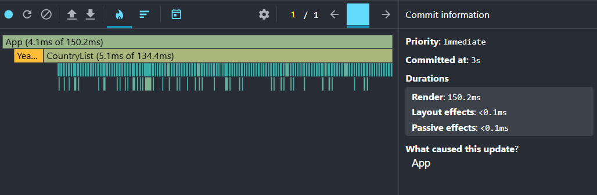
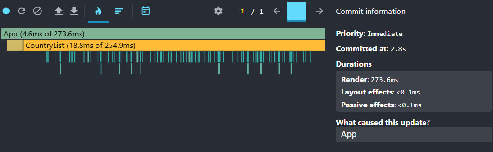
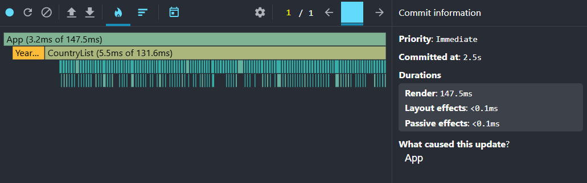
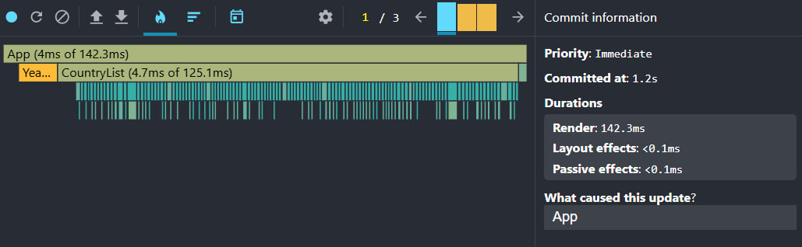
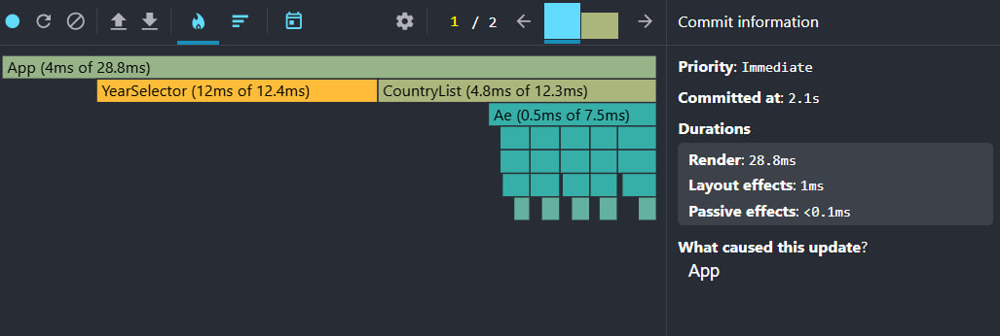
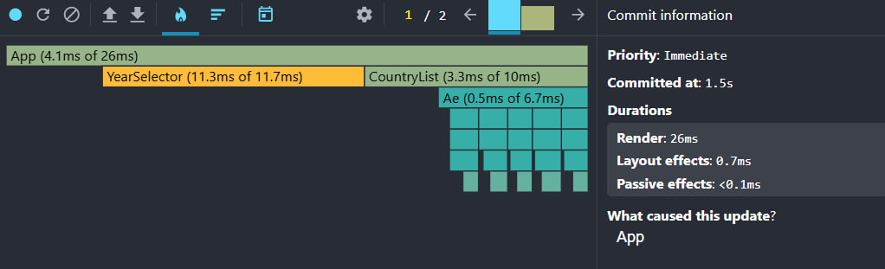
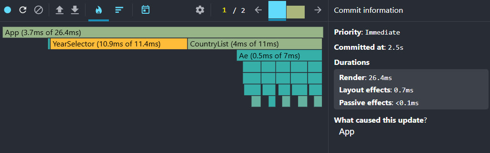
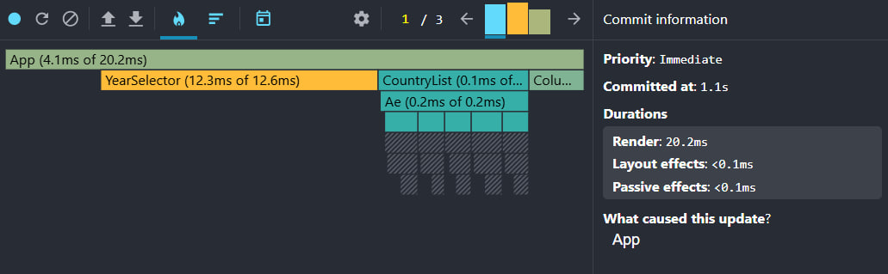

# Performance Report

## Phase 1: Baseline Profiling (Before Optimization)

### 1. Search countries

**Interaction:** Typed in the search input to filter countries.

| Metric | Value |
|--------|-------|
| Render duration | 150.2 ms |
| Commit duration | ~150 ms |
| Caused by | App |

**Flame chart analysis:**
- `App` — 4.1 ms self, 150.2 ms total
- `CountryList` — 5.1 ms self, 134.4 ms total (~89% of render time)
- All country row components re-render on every keystroke

**Screenshot:**

**Bottleneck:** Full `CountryList` re-render on search; no memoization or virtualization.

---

### 2. Sorting countries

**Interaction:** Changed sort field from Population to Name.

| Metric | Value |
|--------|-------|
| Render duration | 273.6 ms |
| Commit duration | ~274 ms |
| Caused by | App |

**Flame chart analysis:**
- `App` — 4.6 ms self, 273.6 ms total
- `CountryList` — 18.8 ms self, 254.9 ms total (~93% of render time)
- Entire country list re-renders after sort change

**Screenshot:**

**Bottleneck:** Sorting triggers full list re-render; filter/sort not memoized.

---

### 3. Selecting a different year

**Interaction:** Selected a different year in the year selector.

| Metric | Value |
|--------|-------|
| Render duration | 147.5 ms |
| Commit duration | ~148 ms |
| Caused by | App |

**Flame chart analysis:**
- `App` — 3.2 ms self, 147.5 ms total
- `CountryList` — 5.5 ms self, 131.6 ms total (~89% of render time)
- `YearSelector` also re-rendered

**Screenshot:**

**Bottleneck:** Year change in App causes full CountryList re-render.

---

### 4. Toggling columns

**Interaction:** Opened column modal and toggled a column.

| Metric | Value |
|--------|-------|
| Render duration | 142.3 ms |
| Commit duration | ~142 ms |
| Caused by | App |

**Flame chart analysis:**
- `App` — 4.0 ms self, 142.3 ms total
- `CountryList` — 4.7 ms self, 125.1 ms total (~88% of render time)
- Column toggle re-renders all country cards and tables

**Screenshot:**

**Bottleneck:** Column state change re-renders entire list instead of affected rows only.

---

## Phase 3: Final Profiling (After Optimization)

Optimizations applied: `useMemo`, `useCallback`, `React.memo`, stable `key` props, and list virtualization with `react-window`.

### 1. Search countries

**Interaction:** Typed in the search input to filter countries.

| Metric | Before | After | Improvement |
|--------|--------|-------|-------------|
| Render duration | 150.2 ms | 28.8 ms | **81%** |
| Commit duration | ~150 ms | ~29 ms | **81%** |
| Caused by | App | App | — |

**Flame chart analysis:**
- `App` — 4 ms self, 28.8 ms total (was 150.2 ms)
- `CountryList` — 4.8 ms self, 12.3 ms total (was 134.4 ms)
- Only visible virtualized rows render instead of all ~250 country cards

**Screenshot:**

**Improvement:** Virtualization limits DOM nodes; `useMemo` caches filtered list; `React.memo` skips unchanged cards.

---

### 2. Sorting countries

**Interaction:** Changed sort field from Population to Name.

| Metric | Before | After | Improvement |
|--------|--------|-------|-------------|
| Render duration | 273.6 ms | 26 ms | **91%** |
| Commit duration | ~274 ms | ~26 ms | **91%** |
| Caused by | App | App | — |

**Flame chart analysis:**
- `App` — 4.1 ms self, 26 ms total (was 273.6 ms)
- `CountryList` — 3.3 ms self, 10 ms total (was 254.9 ms)
- Sort computation memoized; only visible rows re-render after sort

**Screenshot:**

**Improvement:** Largest gain — `useMemo` for filter/sort plus virtualization reduced render time by ~91%.

---

### 3. Selecting a different year

**Interaction:** Selected a different year in the year selector.

| Metric | Before | After | Improvement |
|--------|--------|-------|-------------|
| Render duration | 147.5 ms | 26.4 ms | **82%** |
| Commit duration | ~148 ms | ~26 ms | **82%** |
| Caused by | App | App | — |

**Flame chart analysis:**
- `App` — 3.7 ms self, 26.4 ms total (was 147.5 ms)
- `CountryList` — 4 ms self, 11 ms total (was 131.6 ms)
- `YearSelector` re-renders (not memoized); visible cards update with new year data

**Screenshot:**

**Improvement:** Virtualization renders only visible cards when year changes.

---

### 4. Toggling columns

**Interaction:** Opened column modal and toggled a column.

| Metric | Before | After | Improvement |
|--------|--------|-------|-------------|
| Render duration | 142.3 ms | 20.2 ms | **86%** |
| Commit duration | ~142 ms | ~20 ms | **86%** |
| Caused by | App | App | — |

**Flame chart analysis:**
- `App` — 4.1 ms self, 20.2 ms total (was 142.3 ms)
- `CountryList` — 0.1 ms self (was 125.1 ms total)
- Many memoized components skipped re-render (gray in flame chart)

**Screenshot:**

**Improvement:** `React.memo` on `CountryCard` and `DataTable` prevents full list re-render; only affected visible rows update.

---

## Summary Comparison

| Interaction | Render Before | Render After | Improvement |
|-------------|---------------|--------------|-------------|
| Search | 150.2 ms | 28.8 ms | 81% |
| Sort | 273.6 ms | 26 ms | 91% |
| Year | 147.5 ms | 26.4 ms | 82% |
| Columns | 142.3 ms | 20.2 ms | 86% |
| **Average** | **178.4 ms** | **25.4 ms** | **86%** |

All four interactions show significant performance improvements. The biggest gain was on sorting (~91%), where memoized filter/sort and virtualization eliminated the heaviest baseline bottleneck.